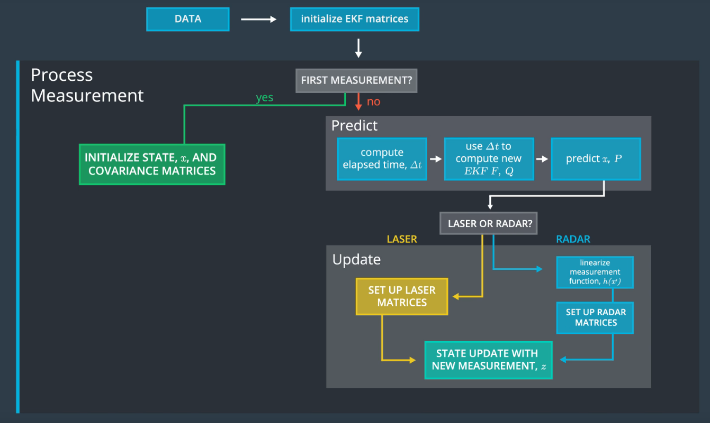
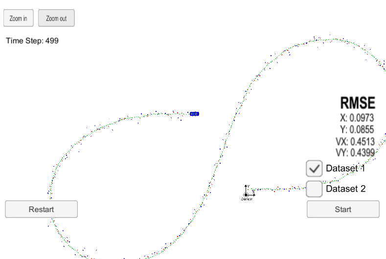
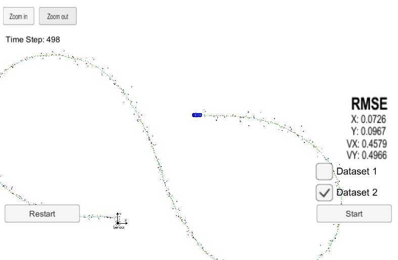

# Extended Kalman Filter Project 
In this project a kalman filter is designed to estimate the state of a moving object of interest with noisy lidar and radar measurements. 

The following algorithm is implemented in C++. Refer to [FusionEKF.cpp](https://github.com/ashsiv/CarND-Extended-Kalman-Filter-Project/blob/master/src/FusionEKF.cpp)



Kalman Filter equations - implemented in [kalman_filter.cpp](https://github.com/ashsiv/CarND-Extended-Kalman-Filter-Project/blob/master/src/kalman_filter.cpp). 


---
## Code Installation setup

* Install [uWebSocketIO](https://github.com/uWebSockets/uWebSockets) for either Linux or Mac systems. For windows you can use [Windows 10 Bash on Ubuntu](https://www.howtogeek.com/249966/how-to-install-and-use-the-linux-bash-shell-on-windows-10/) to install uWebSocketIO. Once the install for uWebSocketIO is complete, the main program can be built and run from the project top directory (see basic build instructions).
---
## Important Dependencies

* cmake >= 3.5
  * All OSes: [click here for installation instructions](https://cmake.org/install/)
* make >= 4.1 (Linux, Mac), 3.81 (Windows)
  * Linux: make is installed by default on most Linux distros
  * Mac: [install Xcode command line tools to get make](https://developer.apple.com/xcode/features/)
  * Windows: [Click here for installation instructions](http://gnuwin32.sourceforge.net/packages/make.htm)
* gcc/g++ >= 5.4
  * Linux: gcc / g++ is installed by default on most Linux distros
  * Mac: same deal as make - [install Xcode command line tools](https://developer.apple.com/xcode/features/)
  * Windows: recommend using [MinGW](http://www.mingw.org/)
  ---
## Basic Build Instructions

1. Clone this repo.
2. Make a build directory: `mkdir build && cd build`
3. Compile: `cmake .. && make` 
   * On windows, you may need to run: `cmake .. -G "Unix Makefiles" && make`
4. Run it: `./ExtendedKF`
---
## Results: Kalman Filter performance

The Kalman Filter performance is evaluated through RMSE (Root Mean Square Error) computation.

```python
For both datasets 1 and 2, RMSE error for position (x,y) is < 0.11 and RMSE error for velocity is < 0.5.
```


### Dataset 1


### Dataset 2

